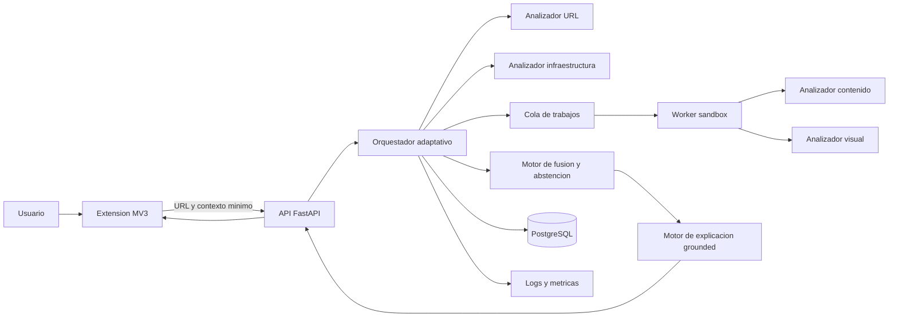
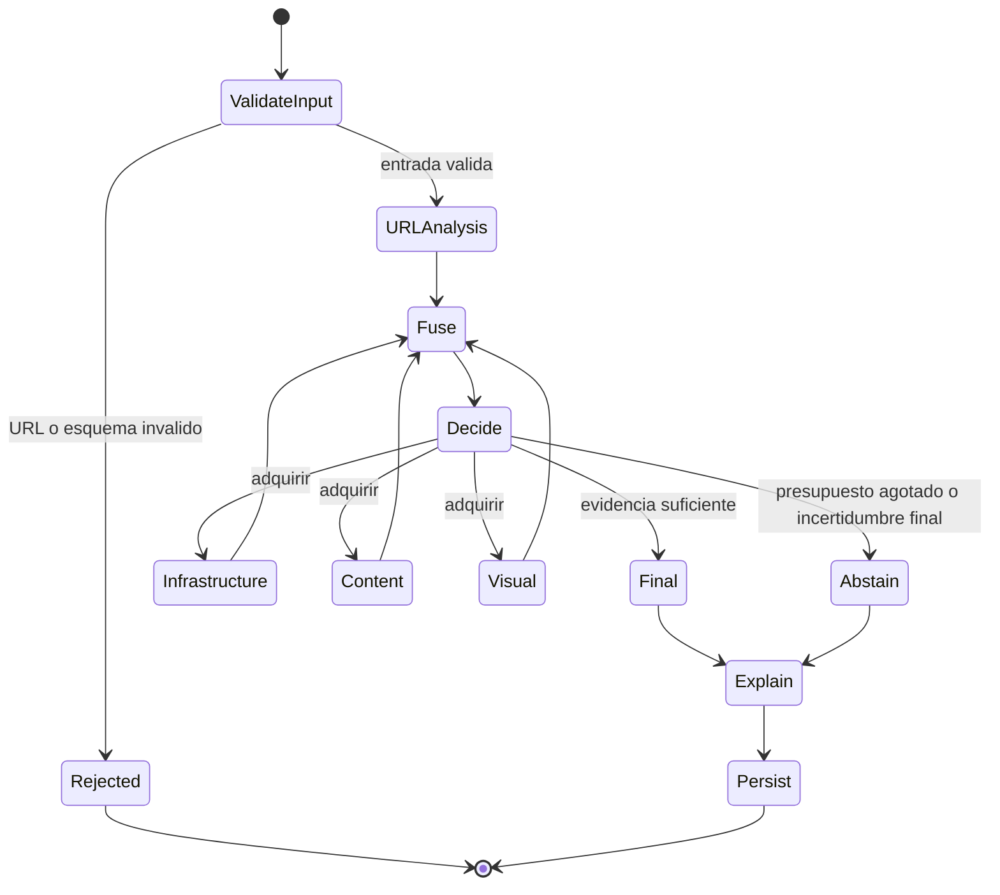
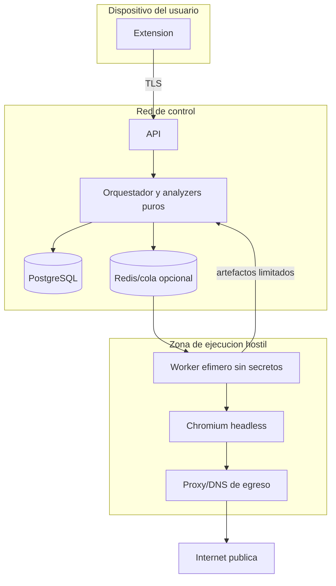

# Arquitectura del sistema

## Vista de contexto



El backend comienza como un monolito modular con workers aislados. Esta forma
reduce carga operativa y mantiene limites de modulo que permiten medir cada etapa.
Solo el worker sandbox recibe permiso de salida a Internet y lo hace mediante un
proxy con politica restrictiva.

## Flujo adaptativo



`Decide` recibe evidencia estructurada, probabilidades calibradas, disponibilidad
de modalidades y presupuesto restante. Cada transicion persiste motivo, score
anterior, score nuevo, coste incremental y version de politica.

## Componentes y responsabilidades

| Componente | Responsabilidad | No debe hacer |
|---|---|---|
| Extension MV3 | Capturar URL, solicitar analisis, advertir y mostrar evidencias | Cargar sitios para analizarlos o ejecutar ML pesado |
| API | Autenticar, validar, aplicar cuotas y exponer estado | Navegar hacia la URL objetivo |
| Orquestador | Ejecutar la maquina de estados y presupuestos | Interpretar texto web como instrucciones |
| URL analyzer | Canonicalizar y extraer features lexicas | Consultar red |
| Infrastructure analyzer | DNS, TLS y redirecciones validadas | Seguir saltos sin revalidar destino |
| Sandbox fetcher | Renderizar y producir artefactos limitados | Acceder a red interna, secretos o filesystem del host |
| Content analyzer | Extraer features de HTML/DOM capturado | Ejecutar acciones solicitadas por la pagina |
| Visual analyzer | Extraer embeddings/features de screenshot | Declarar marca solo por color o logo |
| Fusion/decision | Calibrar, combinar, parar o abstenerse | Consumir prosa de un LLM como evidencia |
| Explanation engine | Ordenar evidencia y verbalizar plantillas | Agregar hechos no presentes en evidencia |
| Experiment logger | Registrar eventos inmutables y costes | Guardar secretos o contenido sensible sin politica |

## Despliegue y fronteras de confianza



El worker usa identidad minima, filesystem efimero, limites de CPU/memoria/PIDs,
sin montaje del socket Docker y sin credenciales de base de datos. El proxy resuelve
y fija destinos publicos; cada redireccion vuelve a pasar por la misma validacion.

## Contratos logicos

### Solicitud de analisis

```json
{
  "url": "https://example.test/login",
  "mode": "research",
  "policy_version": "adaptive-v1",
  "dataset_context": null
}
```

La API devuelve `202 Accepted` con `analysis_id`; el cliente consulta estado o usa
un canal de eventos. El resultado final incluye decision, score, incertidumbre,
evidencia resumida, ruta de adquisicion, timestamp y version del sistema.

### Interfaz de modalidad

Cada analizador implementara conceptualmente:

```text
analyze(AnalysisContext, ArtifactRefs) -> ModalityResult
```

`ModalityResult` contiene estado (`success`, `partial`, `timeout`, `blocked`,
`error`), evidencias tipadas, artefactos, duracion, recursos consumidos y version
del extractor. La ausencia o el fallo de una modalidad es dato explicito, nunca un
valor cero silencioso.

### Evento de decision

```text
decide(EvidenceSnapshot, CalibratedStageOutput, Budget) -> PolicyAction
```

El evento conserva las entradas por referencia/hash, umbrales utilizados, accion,
razon y estado del presupuesto. Esto permite reproducir la ruta sin ejecutar de
nuevo la pagina.

## Persistencia

PostgreSQL almacena metadatos, features, eventos y referencias de artefactos. Los
HTML y screenshots, si la politica etica y de retencion lo permite, se guardan en
almacenamiento de objetos direccionado por hash, cifrado y fuera del acceso directo
del cliente. Redis solo se incorpora cuando una cola o cache con TTL sea necesaria;
no es fuente de verdad.

## Modos de ejecucion

| Modo | Persistencia | Telemetria | Uso |
|---|---|---|---|
| DEVELOPMENT | Muestras sinteticas y retencion corta | Debug sin secretos | Desarrollo local |
| RESEARCH | Eventos completos, versiones y exportacion | Metricas por muestra/corrida | Experimentos controlados |
| PRODUCTION | Minimizacion y retencion definida | Metricas agregadas | Piloto de extension |

## Stack previsto y justificacion

- Python y FastAPI: contratos tipados y ecosistema de ML.
- PostgreSQL: integridad relacional y JSONB para features versionadas.
- Playwright/Chromium dentro de contenedores: adquisicion reproducible de DOM y
  screenshot; la version exacta del navegador queda fijada.
- scikit-learn inicialmente: baselines transparentes, calibracion y metricas.
- React/TypeScript solo si una consola de investigacion aporta valor; la extension
  MV3 puede compartir tipos TypeScript, no necesariamente toda una aplicacion React.
- LangGraph queda fuera de la primera implementacion. La maquina de estados es
  pequena, determinista y mas facil de auditar sin esa dependencia.

## Observabilidad y reproducibilidad

Cada corrida registra `git_commit`, hash de configuracion, versiones de imagen,
dataset, features, modelo, calibrador y politica; semilla; reloj UTC; hardware y
limites. Logs y metricas comparten `analysis_id`, `run_id` y `modality_run_id`.
Los secretos y URLs completas no aparecen en logs operativos; el modo RESEARCH
aplica almacenamiento restringido y exportaciones seudonimizadas cuando proceda.
