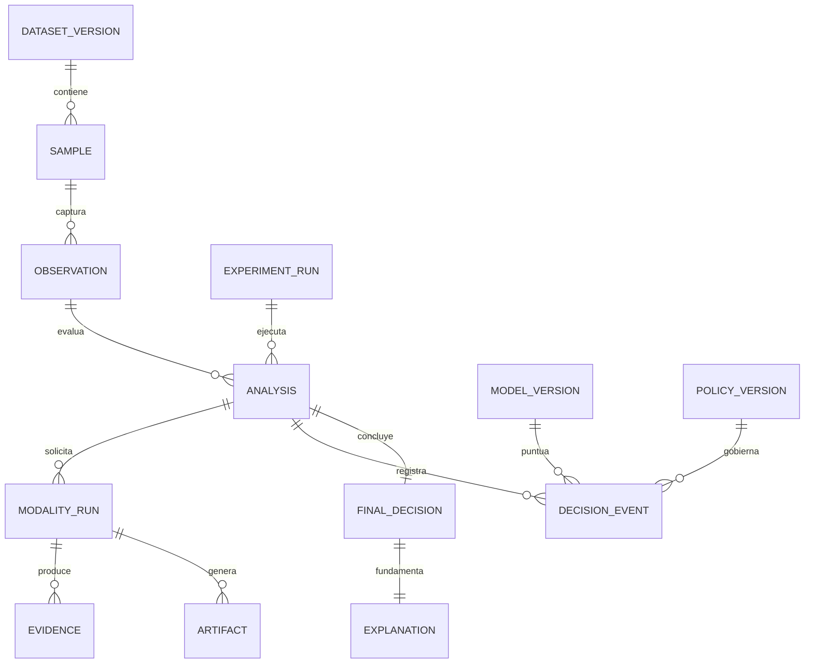

# Modelo de datos

## Principios

1. Toda decision debe reconstruirse con artefactos y versiones persistidas.
2. Los hechos observados, features derivadas, predicciones y explicaciones son
   entidades distintas.
3. Los registros experimentales son append-only; las correcciones crean una nueva
   version o anotacion.
4. Los artefactos grandes se referencian por URI interna y SHA-256.
5. Un valor ausente conserva su razon (`not_acquired`, `timeout`, `blocked`,
   `not_applicable`, `error`), evitando imputacion silenciosa.

## Relacion entre entidades



## Entidades principales

### `dataset_version`

`id`, nombre, version semantica, fuente, fecha de adquisicion, licencia/terminos,
hash del manifiesto, criterios de inclusion/exclusion, conteos, rango temporal y
URI del manifiesto inmutable.

### `sample`

Identidad logica y etiqueta: `sample_id`, `url_encrypted`, `url_hash`, URL
canonicalizada, scheme, host, dominio registrable, etiqueta, fuente, `source_id`,
`first_seen_at`, `label_observed_at`, confianza/origen de etiqueta, `campaign_id`
opcional y estado de revision. La canonicalizacion nunca sobrescribe la URL cruda.

### `observation`

Captura de una muestra en un instante: `observation_id`, `sample_id`,
`observed_at`, disponibilidad, URL final, entorno de captura, versiones de
navegador/proxy/DNS y referencias a artefactos. Distingue la etiqueta historica
de lo que todavia estaba accesible al capturar.

### `experiment_run`

Unidad reproducible: `run_id`, hipotesis/configuracion, split, seed, commit,
hashes de dataset/features/modelo/politica/contenedor, hardware, inicio/fin y
estado. Una corrida sellada no se modifica.

### `analysis`

`analysis_id`, `run_id` opcional, `observation_id`, modo, estado, timestamps,
presupuesto inicial/final, decision final y errores agregados.

### `modality_run`

Una ejecucion de modalidad: ID, analisis, source, ordinal, motivo de adquisicion,
estado, inicio/fin, latencia, CPU, memoria pico, bytes, llamadas externas, tokens,
coste estimado, version de extractor y hashes de entrada/salida.

### `evidence`

Registro atomico y tipado:

```json
{
  "evidence_id": "uuid",
  "analysis_id": "uuid",
  "modality_run_id": "uuid",
  "source": "url",
  "feature_name": "registered_domain_similarity_max",
  "value_type": "float",
  "value": 0.91,
  "unit": null,
  "normalized_value": 0.91,
  "reliability": 0.84,
  "missing_reason": null,
  "observed_at": "2026-09-16T18:00:00Z",
  "extractor_version": "url-features@1.0.0",
  "provenance": {
    "artifact_sha256": null,
    "method": "edit_distance_brand_lexicon",
    "reference_version": "brands@2026-09-01"
  }
}
```

`contribution` no pertenece al hecho observado. Se almacena por separado como
`evidence_attribution`, ligada a una version de modelo y metodo de atribucion, para
no confundir evidencia con interpretacion del modelo.

### `decision_event`

Snapshot por etapa: ordinal, modalidades disponibles/usadas, modelo y calibrador,
score crudo, probabilidad calibrada, incertidumbre, umbrales, accion, razon,
presupuesto y hash del conjunto de evidencias.

### `final_decision`

Decision (`legitimate`, `phishing`, `uncertain`), probabilidad, risk score,
confidence, uncertainty, coverage policy, umbrales, modelo/politica y timestamp.

### `explanation`

Plantilla/version, idioma, lista ordenada de `evidence_id`, texto renderizado,
metodo (`template` o `llm_grounded`), modelo/prompt si aplica y validacion de que
cada afirmacion referencia evidencia. La clasificacion existe antes e independiente
de esta entidad.

### `artifact`

Tipo (`html`, `dom`, `screenshot`, `headers`, `tls_chain`, `network_trace`), URI
interna, SHA-256, MIME detectado, bytes, cifrado, timestamps de creacion/expiracion,
clasificacion de sensibilidad y motivo de eliminacion.

## Diccionario minimo por modalidad

Los nombres definitivos se versionaran en un feature registry. Familias iniciales:

- URL: estructura, entropia, tokens, punycode, IP literal, subdominios, path/query,
  semejanza de marca, typosquatting y combosquatting.
- Infraestructura: resolucion DNS, ASN cuando sea reproducible, TLS/certificado,
  edad/validez, cadena, redirecciones y cambios de dominio.
- Contenido: formularios, campos sensibles, destinos, iframes, scripts, enlaces,
  texto y relaciones same-site/cross-site.
- Visual: embedding versionado, semejanza a referencias, layout, regiones de login
  y consistencia entre marca inferida, dominio y destinos de formularios.

## Versionado

Un feature se identifica por `(feature_name, extractor_version)`. Un modelo declara
el hash exacto del esquema de features esperado. Cualquier cambio de semantica,
normalizacion o referencia externa incrementa la version; nunca se recalculan datos
historicos bajo el mismo identificador.

## Retencion y privacidad

URLs, HTML y screenshots pueden contener tokens o datos personales. Se cifran, se
restringen por rol y se retienen solo el tiempo aprobado para investigacion. Las
exportaciones usan IDs, dominios derivados cuando sean necesarios y features; no
incluyen secretos, cookies, cuerpos enviados ni credenciales. Las capturas no
interactuan con formularios.
